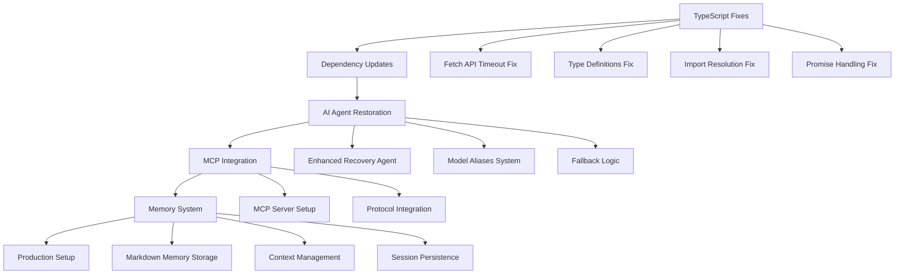

# Дизайн критических исправлений для продакшена

## Обзор

Система Traffic Router AI Platform требует комплексного исправления критических ошибок TypeScript компиляции, восстановления AI агента с MCP интеграцией и подготовки к продакшену. Решение включает исправление типов, обновление зависимостей, восстановление функциональности AI агента и обеспечение стабильности системы.

## Архитектура

### Компоненты системы исправлений



### Слои исправлений

1. **Слой компиляции TypeScript** - исправление всех ошибок типизации
2. **Слой зависимостей** - обновление и исправление пакетов
3. **Слой AI агента** - восстановление полной функциональности
4. **Слой интеграции** - MCP и внешние системы
5. **Слой продакшена** - конфигурация для развертывания

## Компоненты и интерфейсы

### 1. TypeScript Fixes Module

```typescript
// lib/fetch-timeout-polyfill.ts
interface FetchWithTimeout {
  (url: string, options?: RequestInit & { timeout?: number }): Promise<Response>
}

// lib/types/enhanced.ts
interface EnhancedRequestInit extends RequestInit {
  timeout?: number
}

// lib/ai-types.ts
interface OptimizationRule {
  provider: string
  pattern: RegExp
  transform: (body: any) => any
  cacheKey?: (body: any) => string | null  // Исправлено: может возвращать null
  cacheTTL?: number
}
```

### 2. AI Agent Enhancement Module

```typescript
// agents/enhanced-ai-agent.ts
interface AIAgentConfig {
  models: ModelAliasConfig[]
  memory: MemoryConfig
  mcp: MCPConfig
  fallback: FallbackConfig
}

interface ModelAliasConfig {
  alias: string
  provider: 'openai' | 'anthropic' | 'google' | 'local'
  model: string
  endpoint: string
  priority: number
}

interface MemoryConfig {
  storageType: 'markdown' | 'json'
  maxEntries: number
  persistPath: string
}
```

### 3. MCP Integration Module

```typescript
// lib/mcp-integration.ts
interface MCPServer {
  name: string
  command: string
  args: string[]
  env?: Record<string, string>
  disabled?: boolean
  autoApprove?: string[]
}

interface MCPConfig {
  servers: Record<string, MCPServer>
}
```

### 4. Memory System Module

```typescript
// lib/memory-system.ts
interface MemoryEntry {
  id: string
  timestamp: number
  type: 'conversation' | 'context' | 'decision'
  content: string
  metadata: Record<string, any>
}

interface MemoryManager {
  store(entry: MemoryEntry): Promise<void>
  retrieve(query: string): Promise<MemoryEntry[]>
  persist(): Promise<void>
  load(): Promise<void>
}
```

## Модели данных

### Конфигурация исправлений

```typescript
interface FixConfig {
  typescript: {
    strictMode: boolean
    skipLibCheck: boolean
    moduleResolution: 'node' | 'bundler'
  }
  dependencies: {
    update: string[]
    replace: Record<string, string>
    remove: string[]
  }
  aiAgent: {
    enabled: boolean
    models: ModelAliasConfig[]
    memory: MemoryConfig
  }
  production: {
    environment: 'development' | 'production'
    ports: Record<string, number>
    logging: LoggingConfig
  }
}
```

### Статус исправлений

```typescript
interface FixStatus {
  phase: 'typescript' | 'dependencies' | 'ai-agent' | 'mcp' | 'production'
  completed: string[]
  failed: string[]
  inProgress: string[]
  totalSteps: number
  currentStep: number
}
```

## Обработка ошибок

### Стратегия исправления ошибок

1. **TypeScript ошибки**:
   - Fetch timeout: Создание polyfill для Node.js совместимости
   - Типы параметров: Добавление явных типов
   - Импорты модулей: Исправление путей и настройка module resolution
   - Promise в условиях: Добавление await где необходимо

2. **Ошибки зависимостей**:
   - Критические уязвимости: Обновление пакетов
   - Deprecated пакеты: Замена на поддерживаемые альтернативы
   - Отсутствующие типы: Установка @types пакетов

3. **Ошибки инициализации**:
   - NodeJS.Timeout: Правильная инициализация в конструкторах
   - Неопределенные свойства: Добавление инициализации

### Fallback механизмы

```typescript
class ErrorRecoveryManager {
  async handleCompilationError(error: CompilationError): Promise<FixResult> {
    switch (error.type) {
      case 'timeout-property':
        return this.applyFetchTimeoutFix(error)
      case 'missing-types':
        return this.installMissingTypes(error)
      case 'import-resolution':
        return this.fixImportPaths(error)
      default:
        return this.applyGenericFix(error)
    }
  }
}
```

## Стратегия тестирования

### Уровни тестирования

1. **Компиляция**: Проверка успешной сборки TypeScript
2. **Модульные тесты**: Тестирование исправленных компонентов
3. **Интеграционные тесты**: Проверка взаимодействия сервисов
4. **E2E тесты**: Полная проверка функциональности
5. **Нагрузочные тесты**: Проверка стабильности под нагрузкой

### Тестовые сценарии

```typescript
interface TestSuite {
  compilation: {
    typescript: () => Promise<boolean>
    dependencies: () => Promise<boolean>
  }
  functionality: {
    aiProxy: () => Promise<boolean>
    trafficRouting: () => Promise<boolean>
    youtubeCache: () => Promise<boolean>
    monitoring: () => Promise<boolean>
  }
  integration: {
    mcpProtocol: () => Promise<boolean>
    memorySystem: () => Promise<boolean>
    modelAliases: () => Promise<boolean>
  }
  production: {
    dockerBuild: () => Promise<boolean>
    healthChecks: () => Promise<boolean>
    loadTesting: () => Promise<boolean>
  }
}
```

## Конфигурация продакшена

### Переменные окружения

```bash
# Основные настройки
NODE_ENV=production
LOG_LEVEL=info
PORT=13000

# AI сервисы
OPENAI_API_KEY=sk-...
ANTHROPIC_API_KEY=sk-ant-...
GOOGLE_AI_API_KEY=...

# Прокси настройки
PROXY_PORT=13081
SOCKS_PORT=11080
HTTP_PROXY_PORT=13128

# Мониторинг
MONITORING_PORT=13082
HEALTH_CHECK_INTERVAL=30000

# MCP настройки
MCP_SERVER_PORT=3001
MCP_ENABLED=true

# Память агента
MEMORY_STORAGE_PATH=./memory
MEMORY_MAX_ENTRIES=10000
```

### Docker конфигурация

```dockerfile
# Многоэтапная сборка для оптимизации
FROM node:18-alpine AS builder
WORKDIR /app
COPY package*.json ./
RUN npm ci --only=production

FROM node:18-alpine AS runtime
WORKDIR /app
COPY --from=builder /app/node_modules ./node_modules
COPY . .
RUN npm run build:ts
EXPOSE 13000 13081 13082 13083 3001
CMD ["npm", "start"]
```

### Мониторинг и логирование

```typescript
interface ProductionConfig {
  logging: {
    level: 'error' | 'warn' | 'info' | 'debug'
    format: 'json' | 'text'
    outputs: ('console' | 'file' | 'syslog')[]
  }
  monitoring: {
    healthChecks: boolean
    metrics: boolean
    alerts: boolean
    dashboards: boolean
  }
  performance: {
    clustering: boolean
    workers: number
    memoryLimit: string
    cpuLimit: string
  }
}
```

## План развертывания

### Этапы развертывания

1. **Подготовка**: Исправление всех ошибок компиляции
2. **Тестирование**: Полная проверка функциональности
3. **Сборка**: Создание production build
4. **Развертывание**: Запуск в продакшене
5. **Мониторинг**: Отслеживание работы системы

### Критерии готовности

- ✅ Все TypeScript ошибки исправлены
- ✅ Все тесты проходят успешно
- ✅ AI агент полностью функционален
- ✅ MCP интеграция работает
- ✅ Система памяти активна
- ✅ Мониторинг настроен
- ✅ Docker контейнеры собираются
- ✅ Health checks возвращают OK

## Временные рамки

| Этап | Время | Описание |
|------|-------|----------|
| TypeScript исправления | 4 часа | Исправление всех ошибок компиляции |
| Обновление зависимостей | 2 часа | Обновление пакетов и исправление уязвимостей |
| Восстановление AI агента | 6 часов | Полное восстановление функциональности |
| MCP интеграция | 4 часа | Настройка и тестирование MCP |
| Система памяти | 3 часа | Реализация хранения в markdown |
| Тестирование | 3 часа | Полная проверка системы |
| Подготовка к продакшену | 2 часа | Финальная настройка и развертывание |

**Общее время: 24 часа**